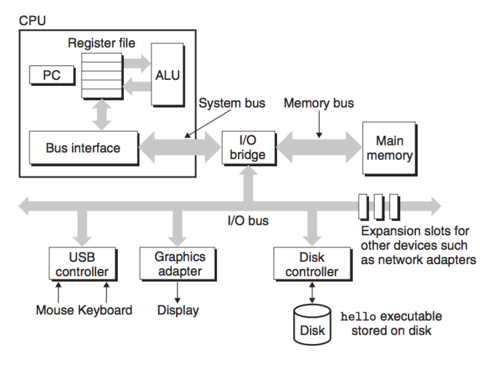

## Part 1. _`A Tour of Computer Systems`_
### _컴퓨터 시스템으로의 여행_

-------

## Intoduction
>   - 이 부분에서는 컴퓨터 시스템과 그 시스템이 응용 프로그램을 만들고 실행하는 데 어떠한 영향을 주는지 본격적으로 배우기 전 매우 고전적이고 간단한 예시인 `hello`라는 프로그램을 통해 이 책의 주제를 소개한다.
>   - 이 프로그램이 프로그래머에 의해 만들어지고, 시스템에서 실행되고, 메시지를 출력하고, 종료될 때 까지의 수명 주기를 추적하는 과정을 따라가며 주요 개념과 용어, 그리고 관련 구성요소 등을 볼 수 있다.

<br>

### hello.c 소스 파일

```c
#include <stdio.h>

int main()
{
    printf("hello, world\n");
    return 0;
}
```
<hr><br>

## 1.1 정보는 비트와 컨텍스트로 이루어진다
 대부분의 컴퓨터 시스템과 마찬가지로, `hello.c` 파일은 ASCII 표준을 사용하여 텍스트를 저장한다. 이 프로그램의 소스 코드를 비롯하여 시스템 내부의 모든 정보, 예를 들면 디스크 파일, 메모리 상의 프로그램, 네트워크를 통해 전송되는 데이터 등은 모두 0 또는 1의 값을 가지는 비트들의 연속이다. 이러한 비트들은 바이트라는 8비트 단위로 구성된다. <hr><br>

 ## 1.2 프로그램은 다른 프로그램에 의해 다른 형태로 번역된다.
 `hello.c` 파일은 고급 언어로 작성되어 있기 때문에 인간이 이해하고 읽을 수 있다. 그러나 이를 시스템에서 실행시키려면, 각각의 C 문장들이 Low Level 기계어 명령어들로 번역되어야 한다. 이들은 실행가능 목적 파일로 합쳐져 바이너리 파일로 저장된다. 이러한 단계들을 나열해보면 아래와 같다:
 - 전처리 단계: 원래 파일을 #으로 시작되는 전처리기의 지시에 따라 수정하여 `hello.i` 파일을 만든다.
 - 컴파일 단계: 컴파일러가 원래 파일을 `hello.s`라는 어셈블리 파일로 변환한다.
    ### hello.s 어셈블리 파일
    ``` v
        .file	"hello.c"
        .text
        .section	.rodata
    .LC0:
        .string	"hello, world"
        .text
        .globl	main
        .type	main, @function
    main:
    .LFB0:
        .cfi_startproc
        pushq	%rbp
        .cfi_def_cfa_offset 16
        .cfi_offset 6, -16
        movq	%rsp, %rbp
        .cfi_def_cfa_register 6
        leaq	.LC0(%rip), %rdi
        call	puts@PLT
        movl	$0, %eax
        popq	%rbp
        .cfi_def_cfa 7, 8
        ret
        .cfi_endproc
    .LFE0:
        .size	main, .-main
        .ident	"GCC: (Ubuntu 7.4.0-1ubuntu1~18.04.1) 7.4.0"
        .section	.note.GNU-stack,"",@progbits
    ```
 - 어셈블리 단계: 어셈블러가 `hello.s`를 기계어 인스트럭션으로 번역하고, 이들을 재배치가능 목적프로그램의 형태로 묶어 `hello.o`라는 목적파일에 그 결과를 저장한다.
 - 링크 단계: hello 프로그램이 C 컴파일러에서 제공하는 표준 C 라이브러리 함수인 `printf`를 실행시켜야 하기 때문에, 링커 프로그램이 별도의 목적 파일인 `printf.o`와 `hello.o`를 결합시켜 실행가능 목적파일(== 실행 파일, Executable File)로 메모리에 적재된다.  <hr><br>

 ## 1.3 컴파일 시스템이 어떻게 동작하는지 이해하는 것은 중요하다.
 - 프로그램 성능 최적화하기: 대부분의 경우는 최신 컴파일러가 복잡한 소스 코드를 빠르고 정확한 프로그램으로 만들어 줄 테지만, 기계어 수준을 이해하고 있어야 C 프로그램을 작성할 때 올바른 판단을 할 수 있다. 예를 들어 switch 문을 if-else문 연속 사용 대신 사용하는 것이 효율적일까? 수식 연산시 괄호를 다르게 배치하는 것 만으로 성능이 향상되는 이유는 무엇인가?
 - 링크 에러 이해하기: 대규모의 프로젝트를 진행할 때는 특히 빌드 과정에서 링커의 동작 관련 오류가 매우 당혹스럽게 만들곤 한다. 정적변수와 전역변수의 차이는 무엇일까? 왜 링커와 관련된 오류는 실행하기 전까지는 나타나지 않는 걸까?
 - 보안 약점 회피하기: 프로그램 스택에 데이터와 제어 정보가 저장되는 방식에 대해서 공부함으로써, 각종 프로그램의 보안 약점의 주요한 원인인 Buffer Overflow 등의 취약성에 대해서 알아볼 수 있다. 프로그래머가 공격의 위협을 줄이기 위해 할 수 있는 것들은 무엇이 있을까? <hr><br>

 ## 1.4 프로세서는 메모리에 저장된 인스트럭션을 읽고 해석한다.
 - `hello.c`소스 파일은 컴파일 시스템에 의해 `hello`라는 실행파일로 변환되어 디스크에 저장되었다. 이 실행파일은 쉘이라는 응용프로그램에서 다음과 같이 실행할 수 있다.
 ```
    linux> ./hello
    hello, world
    linux>
 ``` 
    
### 1.4.1 시스템의 하드웨어 조직
- hello 프로그램을 실행할 때 일어나는 일들은 아래 그림과 같은 전형적인 시스템에서의 하드웨어 조직을 이해할 필요가 있다. 대부분의 시스템은 비슷한 모습과 느낌을 가진다.

